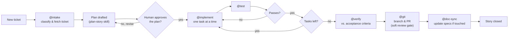

# Harness Engineering Framework v1.0

> Repo: `<this-repo-url>` — once you've cloned or forked this kit into your own workstream repo,
> put its URL here so this doc is a real link, not a placeholder.

**New here? Start with the 60-second version below, then either run the guided dashboard
(`cd onboarding-ui && npm install && npm run dev`) or keep reading.**

---

## The 60-second version

**Agent = Model + Harness.** The model provides intelligence. Left alone, it sees only the file
you have open — it guesses at your patterns, puts code in the wrong directory, and misses how a
change ripples across repos. The **harness** — scoped instructions, on-demand skills, feedback
loops, guardrails — is everything else: the part that turns a generically-smart model into one
that produces code that looks like *your* codebase wrote it.

| | Without a harness | With this harness |
|---|---|---|
| Context | Only the open file/repo | Scoped instructions loaded automatically per file path |
| Patterns | Guesses, often generic | Follows your placement rules and conventions |
| Cross-repo impact | Missed entirely | Blast-radius and dependency checks built in |
| Mistakes | Caught by a human in review | Caught by a sensor (lint/test/verify) and self-corrected first |
| Commit/PR safety | However careful you remember to be | A soft review gate — you see the diff before `git commit`/`git push` |

This kit is that harness, pre-built and portal-agnostic: **9 agents, 9 skills, 3
prompts, one review gate** — plus the one piece of local tooling every multi-repo workstream
actually needs regardless of stack (getting the real repos onto disk, via `config/repos.json`).
Deliberately not included: your team's local dev experience — cloud auth, environment profiles,
IDE workspace layout. That's yours to bring; this kit is scoped to the harness. You adopt it once
per repo instead of reassembling it from scratch.

---

## Why it exists

- **Cuts review toil.** Agents catch their own mistakes — via lint, tests, and an independent
  verify step — before a human ever opens the PR.
- **One convention across repos.** An engineer moving between workstreams doesn't relearn a new
  agent setup each time; the agents, skills, and story lifecycle are the same everywhere this kit
  is adopted.
- **Portal-agnostic.** The *pattern* — path-scoped instructions, a small set of named multi-step
  workflows, a soft commit/PR gate — ports to any agent runtime (Claude Code, GitHub Copilot,
  Cursor, whatever comes next). The file formats under `.github/` are one reference
  implementation of that pattern, not a lock-in.

## How it works, briefly

- **Guides** steer the agent *before* it acts: path-scoped instructions (`.github/instructions/`)
  that load automatically based on which file is open, and specs it reads on demand for deeper
  context.
- **Sensors** catch mistakes *after* it acts: lint, tests, and an independent `@verify` pass hand
  the agent a concrete error to self-correct on — instead of a human catching it three days later
  in review.
- Rules in this kit were earned from real past failures, not auto-generated speculatively. As a
  rule proves itself, promote it from prose into a linter or test so enforcement becomes
  mechanical instead of "the agent remembered to check." See `harness-engineering.md` for the
  full methodology and a worked example.

## What's actually in the box

| Piece | What it does |
|---|---|
| `.github/agents/` | 9 named agents covering the story lifecycle — `@ask`, `@story` (loop controller), `@intake`, `@implement`, `@test`, `@verify`, `@git`, `@doc-sync`, `@orchestrator` |
| `.github/skills/` | 9 on-demand multi-step procedures the agents invoke — planning, PR management, code review, handoff, drift checks |
| `.github/hooks/` | The commit/PR review gate — the one real safety mechanism this kit ships |
| `scripts/` + `config/repos.json` | Multi-repo clone/pull — the substrate that gets a workstream's real repos onto disk for agents to act on |
| `onboarding-ui/` | A guided, local-only dashboard that does the adoption steps below *for* you — see [Getting Started](#getting-started) |

Full detail and the complete file-by-file table: `README.md`.

## Agentic workflow pipeline

How one ticket actually moves through the agents, from intake to close:



`@implement` refuses to touch code before the plan is approved; `@git` refuses to push or open a
PR before the story reaches close. Both refusals are intentional — see `STORY-IMPLEMENTATION-GUIDE.md`
for the phase-by-phase detail behind this diagram.

## Getting Started

**The fast path — a guided dashboard does this for you:**

```bash
cd onboarding-ui && npm install && npm run dev
```

Open the URL it prints. It walks you through cloning this kit, configuring which repos it should
manage, filling in the placeholder files, and running the setup scripts — with a diff preview
before every write and live output for every script, tailored to your stack by a short
questionnaire up front.

**The manual path — same steps, by hand:**

1. Clone or fork this repo as the base for your new workstream repo.
2. Open it in an agent-capable editor and just ask it something — no setup required to try this:
   `@ask "What agents and skills does this harness define?"`
3. Follow `ONBOARDING.md` for the one-time environment setup (tooling, repo config, dev profile).
4. Fill in every file marked `GENERICIZED TEMPLATE` or `TEMPLATE` with your own repo names, test
   commands, and board config — `README.md`'s "Getting Started / How to Adopt" section has the
   checklist.
5. Run your first ticket through the story workflow: `@story "Plan TICKET-XXXX: <description>"` —
   it owns intake through close and delegates to the other agents itself.

Either way, once you're set up: **read `STORY-IMPLEMENTATION-GUIDE.md`** to understand how a real
ticket flows through the pipeline above, phase by phase.

## Where to go next

| Doc | For |
|---|---|
| `harness-engineering.md` | The full methodology — principles, context-rot failure modes, a worked example |
| `README.md` | The complete feature list and file-by-file adoption checklist |
| `ONBOARDING.md` | Tooling prerequisites and the manual one-time setup, step by step |
| `onboarding-ui/README.md` | How the guided dashboard works and what it does under the hood |
| `STORY-IMPLEMENTATION-GUIDE.md` | How a ticket actually moves through the agents, phase by phase |
| `CONTRIBUTING.md` | How to propose changes to the shared harness itself |
